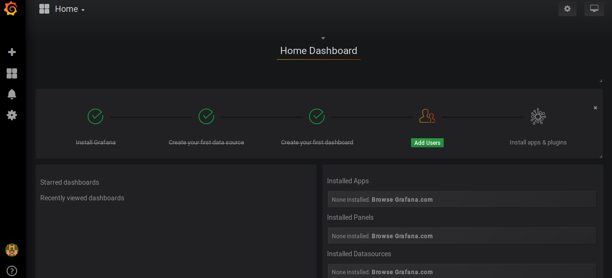
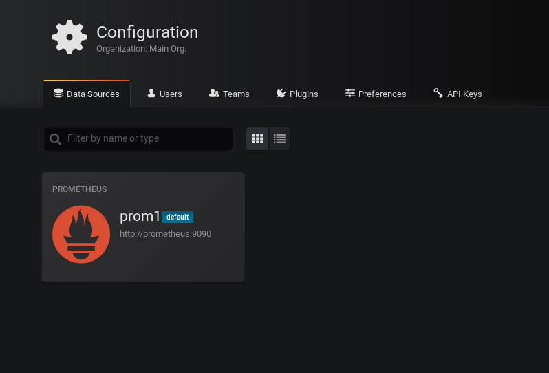
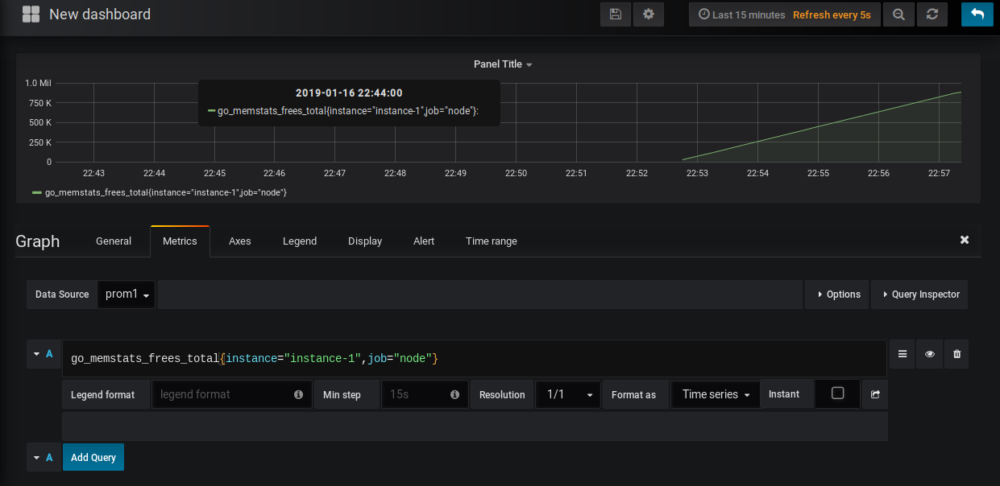

Simple hello-world web app written in go
======
**Helloweb** is an example of simple dockerized go app. To run it follow the steps:

```
$ docker build -t helloweb .
 ...
$

$ docker run -p 1234:1234 helloweb
  2019/01/14 17:47:11 Listenting on port 1234...
$
```
Browse to 0.0.0.0:1234 and you should get basic hello-world web app

## To access the prometheus metrics visualized in grafana run docker-compose up
```
$ docker-compose up
 ...
$
```

## Open 0.0.0.0:3000 in your browser and enter admin/newpassword as for login/password
As you can see, datasource and dash were automatically created




## Datasource was automatically populated, therefore prometheus metrics are accessible by default.






## Version
* Version 1.0

## Contact
#### Developer/Company
* Homepage: github.com/azizakubat
* e-mail: kubatbek_k@auca.kg
